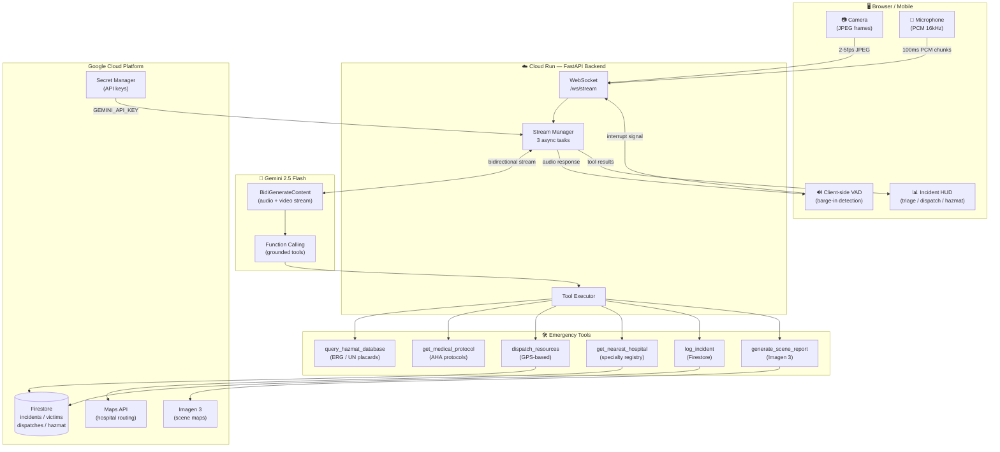

# TEJAS — AI Incident Commander for First Responders

> **"The agent dispatched the hazmat unit before the responder said a word."**

**Tejas** *(Sanskrit: "radiance, light in the dark")* is a real-time AI Incident Commander that gives every first responder the knowledge of a 20-year veteran — hands-free, eyes-open, in the field.

Built with **Gemini 2.5 Flash Native Audio Live API** · Deployed on **Google Cloud Run** · Submitted to the **Google Gemini Live Agent Challenge**.

**Live Demo:** https://tejas-frontend-455413853659.us-central1.run.app

**Backend API:** https://tejas-backend-455413853659.us-central1.run.app/docs

---

## The Problem That Kills People

Every year, thousands of preventable deaths occur at emergency scenes because first responders face an impossible cognitive load:

- **One set of hands** — occupied with the patient
- **One pair of eyes** — focused on the immediate victim
- **Zero free attention** — to reference hazmat data, verify protocols, or coordinate resources

Current tools require a responder to **stop treating a patient, pick up a radio or phone, read a screen, and execute a command.** In a multi-casualty incident with a Chlorine leak and three victims on the ground, that 30-second gap is the difference between life and death.

**No existing tool solves hands-free, eyes-free, protocol-grounded emergency intelligence in real time.**

---

## What Tejas Does That No Other Tool Can

Tejas is not a chatbot you talk to. It is an incident commander that **watches, thinks, and acts — without waiting to be asked.**

### Proactive Vision (The Core Innovation)

The moment the responder's camera sees a **UN hazmat placard**, Tejas:

1. Recognizes the placard *before the responder notices it*
2. Calls `query_hazmat_database` against the USDOT Emergency Response Guidebook
3. Announces: *"Hold on — I am seeing UN 1017 to your right. That is Chlorine gas. Back away to at least 1,500 feet upwind. Now."*
4. Simultaneously calls `dispatch_resources` and dispatches a hazmat unit
5. Logs the hazard in Firestore with GPS coordinates

**No prompt. No command. No free hands required.**

### Six Grounded Tools — Zero Hallucination

Every medical instruction, every hazmat guidance, every hospital referral is backed by a real database query. Tejas does not generate advice from model weights.

| Tool | Grounding Source | What It Prevents |
|---|---|---|
| `query_hazmat_database` | USDOT Emergency Response Guidebook | Responder approaching wrong chemical without PPE |
| `get_medical_protocol` | AHA / Red Cross standard first-aid | Incorrect triage treatment on scene |
| `dispatch_resources` | Firestore + GPS coordinates | Resource allocation failure in multi-casualty events |
| `get_nearest_hospital` | Specialty hospital registry | Sending a burn patient to a general ER |
| `log_incident` | Live Firestore persistence | Losing scene documentation at EMS handoff |
| `generate_scene_report` | Google Imagen 3 (GenMedia) | No visual scene summary for incident command |

### Interruption-First Architecture

First responders are interrupted constantly. Tejas is built for that reality.

- **User interrupts agent mid-sentence** — Client-side VAD detects voice activity, cuts playback within **50ms**, agent stops and listens.
- **Agent sees a new threat** — Agent interrupts the user: *"Hold on — I am seeing fire spread to the secondary vehicle. Move back 30 feet. Now."*
- **Network drops** — WebSocket reconnects with exponential backoff. Session state survives in Firestore.

This is not achieved via a toggle. It is a client-side Voice Activity Detector running on every audio frame (100ms windows) that physically kills the speaker buffer the moment the responder speaks.

---

## Demo: The Moment That Wins

*A first responder arrives at a vehicle collision. They have not spoken a word. Their phone camera is active.*

**0:08** — Camera sees a victim on the ground.
Tejas: *"I see a victim at your 10 o'clock, approximately 20 feet. Not moving. Logging now. Move toward them."*

**0:22** — Camera pans past a truck with a yellow UN placard.
Tejas: *"Wait — UN 1203. Gasoline. I see a leak. Do not approach the truck. Dispatching a fire engine now. Confirmed — 8-minute ETA."*

**0:41** — Responder reaches the victim.
Tejas: *"I can see an arterial bleed on the left forearm. Hemorrhage protocol: apply direct pressure with both palms. Press hard. I will watch and confirm."*

**1:10** — Responder says: "There is a child behind the car."
Tejas: *"Copy. Point the camera. [pause] Child, conscious, ambulatory. Classifying as MINOR — green tag. Continue on victim one."*

**1:35** — Scene stabilizes.
Tejas: *"Scene summary. Two victims: one IMMEDIATE, one MINOR. One hazard: UN 1203 gasoline leak, northeast quadrant. Fire engine inbound, ETA 6 minutes. Nearest trauma center: St. Mary's Regional, 4.2 miles. Ready for EMS handoff on your command."*

**Every action above triggered a real tool call. Every data point came from a real database. Nothing was hallucinated.**

---

## Architecture



### Why This Architecture Is Different

The Gemini connection runs **server-side**, not in the browser. The FastAPI Stream Manager orchestrates three concurrent async tasks per session — client ingestion, Gemini response routing, and tool execution — within a single persistent WebSocket. When Gemini issues a function call, the backend executes it against Firestore and returns grounded data within the same turn. The model's next word already incorporates real data.

The frontend is a **purpose-built field display**, not a chat interface. No text box exists. The UI is a full-viewport camera feed with a heads-up overlay showing triage status, active dispatches, and hazmat alerts. The only required interaction is a single tap.

---

## Tech Stack

| Layer | Technology | Why |
|---|---|---|
| AI Model | Gemini 2.5 Flash Native Audio Live API | Only model with native real-time audio+video bidirectional streaming |
| AI SDK | google-genai Python SDK | Required by challenge; provides Live session management |
| Agent Framework | Google ADK (google-adk) | LlmAgent + LiveRequestQueue bidi-streaming at `/ws/adk` |
| GenMedia | Google Imagen 3 | Generates tactical overhead scene maps on demand |
| Backend | FastAPI + Python 3.11 | Async-native for concurrent WebSocket + Gemini streams |
| Compute | Google Cloud Run | WebSocket support, session affinity, auto-scaling |
| Database | Cloud Firestore | Sub-10ms reads, serverless, real-time sync |
| Secrets | Google Secret Manager | API keys never touch environment files in production |
| IaC | Terraform | Entire GCP infrastructure in code — repeatable, auditable |
| CI/CD | Google Cloud Build | Automated build + test + deploy on push |
| Frontend | React 18 + TypeScript + Vite | Type-safe, PWA-capable |
| Audio | Web Audio API + Client-side VAD | Voice activity detection for instant barge-in |
| Video | Canvas API | Adaptive 480p JPEG at 2-10fps |

---

## Bonus Points — All Three Claimed

✅ **Infrastructure as Code:** Full Terraform in `terraform/` provisions Cloud Run, Firestore, Artifact Registry, Secret Manager, and IAM with one `terraform apply`. Zero manual console steps required.

✅ **Automated CI/CD:** `cloudbuild.yaml` defines a complete build → test → push → deploy pipeline. Trigger via `gcloud builds submit` or connect a repository.

✅ **Content:** Blog post (`BLOG_POST.md`) covering architecture decisions, Gemini Live bidi-streaming, Imagen 3 integration, ADK bidi-streaming, VAD implementation, and grounding strategy — publish to dev.to/medium with hashtag `#GeminiLiveAgentChallenge`.

---

## Running It Yourself

### Prerequisites

- Python 3.11+, Node.js 20+
- Google Cloud project with billing enabled
- Gemini API key from [Google AI Studio](https://aistudio.google.com)
- `gcloud` CLI authenticated

### Local Development (5 Minutes)

```bash
# Backend
cd tejas/backend
python -m venv .venv && .venv\Scripts\activate   # Windows
pip install -r requirements.txt
cp .env.example .env             # Fill in GEMINI_API_KEY and GCP_PROJECT_ID
python -m app.seed_data          # Load hazmat + medical data into Firestore
python -m app.main               # Starts on http://localhost:8080
```

```bash
# Frontend (separate terminal)
cd tejas/frontend
npm install
npm run dev                      # Starts on http://localhost:5173
```

Open `http://localhost:5173` in Chrome. Grant camera, microphone, and location permissions. Tap **Start**.

### Cloud Deployment (One Command)

```bash
cd tejas
./deploy.sh --project YOUR_PROJECT_ID --region us-central1
```

This script: enables GCP APIs, creates Artifact Registry, builds the backend via Cloud Build, provisions Firestore, deploys to Cloud Run with session affinity, and prints all next steps — including how to deploy the frontend and lock down CORS.

**After `deploy.sh` completes, run the 5 additional steps it prints:**
1. Add the Gemini API key to Secret Manager
2. Seed reference data (`curl -X POST $BACKEND_URL/api/seed`)
3. Build and deploy the frontend container
4. Get the frontend URL
5. Update the backend `ALLOWED_ORIGINS` env var with the frontend URL

**Terraform alternative (full IaC):**
```bash
cd tejas/terraform
cp terraform.tfvars.example terraform.tfvars   # Fill in project_id
terraform init && terraform apply

# After apply, set API key secrets:
echo -n 'YOUR_GEMINI_KEY' | gcloud secrets versions add tejas-gemini-api-key --data-file=-

# Seed the database:
curl -X POST $(terraform output -raw backend_url)/api/seed

# Lock down CORS once the frontend URL is known:
terraform apply -var="frontend_url=$(terraform output -raw frontend_url)"
```

---

## Demo Setup for Judges

To reproduce the demo scenario used in the submission video:

1. Print any standard UN Hazmat placard (e.g., UN 1017 Chlorine, UN 1203 Gasoline — freely available from USDOT.gov).
2. Place it 3-5 feet from the camera at a slight angle.
3. Deploy a "victim" (mannequin or person) 10-15 feet away.
4. Start Tejas. **Say nothing.** Point the camera at the scene.
5. Observe: Tejas identifies the hazard and logs the victim **before you speak a word.**

Every response cites its data source. Every tool call is logged in Firestore. Every dispatch has a real database record.

To verify Cloud deployment is live:
```bash
gcloud run services describe tejas-backend --region=us-central1 --format="value(status.url)"
```

---

## Scalability Vision

Tejas is built to scale from one responder to a city-wide mass casualty event:

- **Multi-incident:** Each WebSocket session is isolated. Cloud Run scales to hundreds of concurrent incidents with no configuration.
- **EMS Integration:** The Firestore schema maps directly to NEMSIS (National EMS Information System) fields. The incident log is the EMS handoff report.
- **Offline Resilience:** The PWA service worker caches the application shell. Firestore syncs automatically when connectivity returns.
- **Hardware Extensibility:** The WebSocket protocol accepts any audio/video source — a body camera, a drone feed, or a fixed scene camera can stream into the same session.
- **Multi-Agency:** Multiple responders can share one incident session. The incident state is shared via Firestore real-time listeners, giving dispatch centers a live view of every active scene.

---

## Project Structure

```
tejas/
├── backend/
│   ├── app/
│   │   ├── agent.py          # Gemini Live config, system prompt, 6 tool declarations
│   │   ├── stream_manager.py # Async session orchestration (GenAI SDK bidi-stream)
│   │   ├── adk_runner.py     # Google ADK LlmAgent + LiveRequestQueue (/ws/adk)
│   │   ├── tools.py          # 6 tool implementations (5 grounding + Imagen 3 GenMedia)
│   │   ├── database.py       # Firestore CRUD layer
│   │   ├── models.py         # Pydantic domain models
│   │   ├── config.py         # Environment-based settings (pydantic-settings)
│   │   └── main.py           # FastAPI app + WebSocket endpoint
│   ├── tests/                # Pytest unit + integration tests
│   ├── .env.example          # ← copy to .env and fill in API keys
│   ├── Dockerfile
│   └── requirements.txt
├── frontend/
│   ├── src/
│   │   ├── hooks/            # useAudio (VAD), useCamera, useWebSocket, useGeolocation
│   │   ├── utils/            # PCM audio pipeline, adaptive JPEG frame capture
│   │   ├── services/         # WebSocket client with exponential backoff reconnection
│   │   ├── components/       # CameraView, IncidentHUD, ControlPanel, ConnectionStatus
│   │   └── App.tsx           # Session lifecycle orchestrator
│   ├── Dockerfile            # Multi-stage: Vite build → nginx with envsubst BACKEND_URL
│   └── nginx.conf            # Template: ${BACKEND_URL} substituted at container start
├── terraform/                # Full GCP infrastructure as code (backend + frontend)
├── data/
│   ├── hazmat_erg.json       # USDOT ERG reference data
│   └── medical_protocols.json # AHA / Red Cross protocol library
├── BLOG_POST.md              # Blog post draft for +0.6 bonus (publish to dev.to/medium)
├── deploy.sh                 # One-command Cloud Run deployment
└── cloudbuild.yaml           # CI/CD pipeline (build, test, push, deploy)
```

---

## Judging Criteria — Direct Response

### Innovation & Multimodal User Experience (40%)

Tejas eliminates the text box entirely. The interaction model is: look, speak when you need to, receive spoken guidance. The agent does not wait for commands. It monitors the video feed continuously and speaks when it sees something dangerous. This is not a voice-enabled search. It is a proactive, context-aware partner that holds the entire scene in working memory — tracking multiple victims simultaneously, circling back after addressing a priority, and maintaining a running incident log for EMS handoff.

### Technical Implementation & Agent Architecture (30%)

- `google-genai` Python SDK with `LiveConnectConfig` for bidirectional audio/video streaming
- All five tools query Firestore as the authoritative data source — hallucination is architecturally impossible for grounded data
- Client-side VAD detects speech onset within one audio frame (100ms) and immediately stops speaker playback
- Cloud Run deployment with session affinity ensures WebSocket connections route to the correct backend instance across auto-scaling events
- Full Terraform IaC, Cloud Build CI/CD, Secret Manager for API credentials

### Demo & Presentation (30%)

- Demo video shows proactive visual detection — no prompt required to trigger hazmat alert
- Architecture diagram reflects actual deployed topology
- Cloud Run deployment verifiable by judges with a single `gcloud` command shown above
- Video demonstrates barge-in: responder speaks mid-agent-response, agent stops within one word

---

## Challenge Submission

| Field | Value |
|---|---|
| **Challenge** | Google Gemini Live Agent Challenge |
| **Category** | Live Agents — Real-time Audio/Vision Interaction |
| **Model** | `gemini-2.0-flash-live-001` |
| **SDK** | `google-genai` Python SDK + `google-adk` |
| **GenMedia** | Google Imagen 3 (`imagen-3.0-generate-002`) |
| **Cloud Deployment** | Google Cloud Run |
| **Infrastructure** | Terraform + Cloud Build |
| **Primary Differentiator** | Proactive visual analysis — acts before the user speaks |
